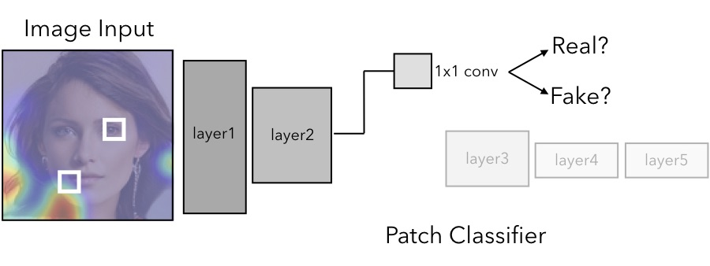

# Patch Forensics
[Project Page](https://chail.github.io/patch-forensics/) |  [Paper](http://arxiv.org/abs/2008.10588) 

What makes fake images detectable? Understanding properties that generalize  
[Lucy Chai](http://people.csail.mit.edu/lrchai/), [David Bau](https://people.csail.mit.edu/davidbau/home/), [Ser-Nam Lim](https://scholar.google.com/citations?user=HX0BfLYAAAAJ&hl=en), [Phillip Isola](http://web.mit.edu/phillipi/)  
ECCV 2020

  

**Note:** Our method is susceptible to many of the same shortcomings that are common to deep networks, such as unexpected behavior due to adversarial attacks, out-of-domain input, or input preprocessing. Here we focus on face datasets, which have natural structure allowing them to be be automatically detected and aligned, but the same approaches many not necessarily work on other domains. However, we hope that a patch-based visualization approach can help people anticipate where detectable artifacts and manipulations can occur in a facial image, and how these artifacts can be exaggerated or hidden by changing the generator. 


## Prerequisites
- Linux
- Python 3
- CPU or NVIDIA GPU + CUDA CuDNN

**Table of Contents:**<br>
1. [Setup](#setup)<br>
2. [Data Preprocessing](#preprocessing)<br>
3. [Evaluate and visualize](#visualize)<br>
4. [Training](#training)<br>

<a name="setup"/>

## Setup

- Clone this repo:
```bash
git clone https://github.com/chail/patch-forensics.git
```
- Install dependencies:
	- we provide a Conda `environment_basic.yml` file listing the dependencies. You can create a Conda environment with the dependencies using:
```bash
conda env create -f environment_basic.yml
```

- Download resources:
	- we provide a script for downloading associated resources. Fetch these by running:
```bash
cd resources && bash download_resources_basic.sh
```

<a name="preprocessing"/>

## Data Preprocessing

We found that data preprocessing had a big impact on our results. Namely, the real datasets are saved in some fixed format, but the dataset that we create from generator samples can have whatever format we like. With this inconsistency, we found that we could get misleadingly high generalization across different datasets, when the models in fact were not learning the task at hand! Therefore, we preprocess the real datasets to make them as similar as possible to the generated samples by passing the real images through the generator's preprocessing pipeline before saving them; we extract [CelebA-HQ](https://github.com/tkarras/progressive_growing_of_gans) and [FFHQ](https://github.com/NVlabs/ffhq-dataset) datasets from the TFRecords used to train the generators, at the corresponding resolution of the generator (e.g. smaller resolution for smaller generators).  

We provide a smaller version of the processed datasets (test set) [here](https://drive.google.com/drive/folders/1_LekvsBFE2T9N3Wikkll3xjlogI-cSoH?usp=sharing). Once downloaded, unzip and place this in the `datasets/` directory. You should be able to use the pretrained models (see following) with this subset.

To replicate the full dataset pipeline (e.g. for training) there are a few additional steps:

- Create and activate an environment with the additional requirements:
```bash
conda env create -f environment_data.yml
```

- Download additional resources:
```bash
cd resources && bash download_resources_data.sh
```

- Additional setup:
	- Create CelebA-HQ TFRecords following [these instructions](https://github.com/tkarras/progressive_growing_of_gans#preparing-datasets-for-training). Place the TFRecords in `resources/tfrecords/celebahq/`.
	- Download FFHQ TFRecords following [these instructions](https://github.com/NVlabs/ffhq-dataset). Place the TFRecords in `resources/tfrecords/ffhq`.
	- Download the Glow pretrained model using `resources/glow/demo/script.sh`
	- For GMM training we used default training settings at the [torch-mfa repository](https://github.com/eitanrich/torch-mfa), saving real images from the `train_set` and `test_set` datasets and fake images from the trained model output.
	- For the face forensics experiments we will not release our preprocessed dataset, as this dataset is not publicly available. However, this dataset can be downloaded from [their repo](https://github.com/ondyari/FaceForensics). Note that we used the `faceforensics_download_v4.py` script, the file paths to original and manipulated sequence videos may vary slightly depending on which download script version you use. We detect and align the face in these using a facial landmark detector, similarly to the celebahq alignment. For the following scripts, we assume that the dowloaded location is `resources/faceforensics_raw`

The following scripts contain details on how we preprocessed and created the real/fake datasets:
```bash
scripts/00_data_processing_export_tfrecord_to_img.sh
scripts/00_data_processing_sample_celebahq_models.sh
scripts/00_data_processing_sample_ffhq_models.sh
scripts/00_data_processing_faceforensics_aligned_frames.sh
```


<a name="visualize"/>

## Evaluate and Visualize

We provide a number of pretrained models [here](https://drive.google.com/drive/folders/1_LekvsBFE2T9N3Wikkll3xjlogI-cSoH?usp=sharing). Once downloaded, unzip and place this in the `checkpoints/` directory. 

### Quickstart

The evaluation pipeline is summarized in the following scripts. The steps are 1) compute average precision metrics 2) overlay patch-wise heatmaps 3) compute top patches based on semantic clusters. More details are provided below.
```bash
bash scripts/04_eval_checkpoint.sh
bash scripts/04_eval_visualize_gen_models.sh
bash scripts/04_eval_patches_gen_models.sh
```

### Evalute patch-wise average precision

To evaluate a checkpoint, follow the example below, adjusting the checkpoint configuration file, paths to real and fake datasets, and name for the dataset as necessary:
```bash
python test.py --gpu_ids 0 --which_epoch best_val --partition test \
	--dataset_name celebahq-pgan-pretrained \
	--real_im_path dataset/faces/celebahq/real-tfr-1024-resized128/test \
	--fake_im_path dataset/faces/celebahq/pgan-pretrained-128-png/test \
	--train_config checkpoints/gp1-gan-winversion_seed0_xception_block2_constant_p20/opt.yml
```

As a utility function, there is a wrapper to run a group of test datasets (e.g. the `gen_models` group) given a model checkpoint:
```bash
python test_runs.py \
	checkpoints/gp1-gan-winversion_seed0_xception_block2_constant_p20 \
	gen_models test
```

For corresponding scripts, see the following (note that you will need to preprocess the face forensics dataset to run the associated experiments):
```bash
scripts/04_eval_checkpoint.sh
```

This test pipeline computes average precision for patch-based models based on averaging logits before or after a softmax operation, or using patch-wise votes. The data will be saved in:
`results/<checkpoint_name>/<partition>/<which_epoch>/<dataset_name>`

### Draw patch-wise heatmap

Next, to evaluate a checkpoint and also draw patch-wise heatmap predictions, an example command is (note the options `--visualize and --average_mode` ):
```bash
python test.py --which_epoch bestval --gpu_ids 0 --partition $partition \
        --visualize --average_mode after_softmax --topn 100 --force_redo \
        --dataset_name celebahq-pgan-pretrained \
        --real_im_path dataset/faces/celebahq/real-tfr-1024-resized128/$partition \
        --fake_im_path dataset/faces/celebahq/pgan-pretrained-128-png/$partition \
        --train_config checkpoints/gp1-gan-winversion_seed0_xception_block2_constant_p20/opt.yml
```

The following scripts contain the full settings:
```bash
scripts/04_eval_visualize_gen_models.sh
scripts/04_eval_visualize_faceforensics_F2F.sh
scripts/04_eval_visualize_faceforensics_DF.sh
```

This will visualize the patch-wise predictions heatmap of the top 100 easiest and hardest to classify images in each test set. The results will be saved in: `results/<checkpoint_name>/<partition>/<which_epoch>/<dataset_name>/vis`.

Within each directory, you can use the `+lightbox.html` to show all images in the directory in your browser.


### Compute patch-wise histogram

To use a face segmenter to categories the most predictive patch in each image, there are two steps -- first is to compute the most predictive patch (`patches.py`) and second is to apply the segmenter on these patches to assign each patch to a semantic cluster (`segmenter.py`). An example command is:
```bash
partition=test
ckpt=gp1-gan-winversion_seed0_xception_block2_constant_p20
name=celebahq-pgan-pretrained
python patches.py --which_epoch bestval --gpu_ids 0 \
        --topn 10000 --unique --partition $partition \
        --train_config checkpoints/$ckpt/opt.yml \
        --dataset_name $name \
        --real_im_path dataset/faces/celebahq/real-tfr-1024-resized128/$partition/ \
        --fake_im_path dataset/faces/celebahq/pgan-pretrained-128-png/$partition/
python segmenter.py results/$ckpt/$partition/epoch_bestval/$name/patches_top10000/
```

The following scripts contain the full settings:
```bash
scripts/04_eval_patches_gen_models.sh
scripts/04_eval_patches_faceforensics_F2F.sh
scripts/04_eval_patches_faceforensics_DF.sh
```

The data will be saved in:
`results/<checkpoint_name>/<partition>/<which_epoch>/<dataset_name>/patches_top10000`

The patches based on semantic segmentation category will be saved at:
`results/<checkpoint_name>/<partition>/<which_epoch>/<dataset_name>/patches_top10000/clusters`.

### Notebooks

Once the previous scripts are run, we provide some notebooks to create tables and graphs from the generated data. You will first have to run `bash notebooks/setup_notebooks.sh`. 
```bash
notebooks/tables.ipynb
notebooks/overlay_heatmap.ipynb
notebooks/histograms.ipynb
```

<a name="training"/>

## Training

For training a model to discriminate between real and generated samples, see the following example command. This will save checkpoints in the `checkpoints/` directory.
```bash
python train.py --gpu_ids 0 --seed 0 --loadSize 299 --fineSize 299 \
        --name example_train_run --save_epoch_freq 200 \
        --real_im_path dataset/faces/celebahq/real-tfr-1024-resized128 \
        --fake_im_path dataset/faces/celebahq/pgan-pretrained-128-png \
        --suffix seed{seed}_{which_model_netD}_{lr_policy}_p{patience} \
        --which_model_netD xception_block2 --model patch_discriminator \
        --patience 20 --lr_policy constant --max_epochs 1000 \
        --no_serial_batches
```

Since the dataset consists of aligned faces and the patch discriminator is trained over small sliding patches of the image, we found that training on the full image was often comparable to or better than adding random crops or random resized crops during training. We also tried variations of training on only generated samples as the fake dataset, real images inverted through the generator as the fake dataset, and a combination of both. See the following scripts for additional training examples:
```bash
bash scripts/01_train_gan_xception_patches_winversion.sh
bash scripts/01_train_gan_xception_patches_winversion_randcrop.sh
bash scripts/01_train_gan_xception_patches_winversion_randresizecrop.sh
bash scripts/01_train_gan_xception_patches_invonly.sh
bash scripts/01_train_gan_xception_patches_samplesonly.sh
```

We provide similar scripts for the FaceForensics dataset (operating on preprocessed frames), and training setups for other full and truncated model variations. These are also located in the `scripts/` directory.

During training, tensorboard data will be logged to `runs/`, which can be plotted using a tensorboard server:
```bash
tensorboard --logdir runs/ --port 6006
```

To continue training from a dataset, see the following example:
```bash
python train.py checkpoints/<checkpoint_name>/opt.yml --load_model \
	--which_epoch latest --overwrite_config
```

### Citation
If you find this code useful, please cite our paper:
```
@inproceedings{patchforensics,
  title={What makes fake images detectable? Understanding properties that generalize},
  author={Chai, Lucy and Bau, David and Lim, Ser-Nam and Isola, Phillip},
  booktitle={European Conference on Computer Vision},
  year={2020}
 }
```
